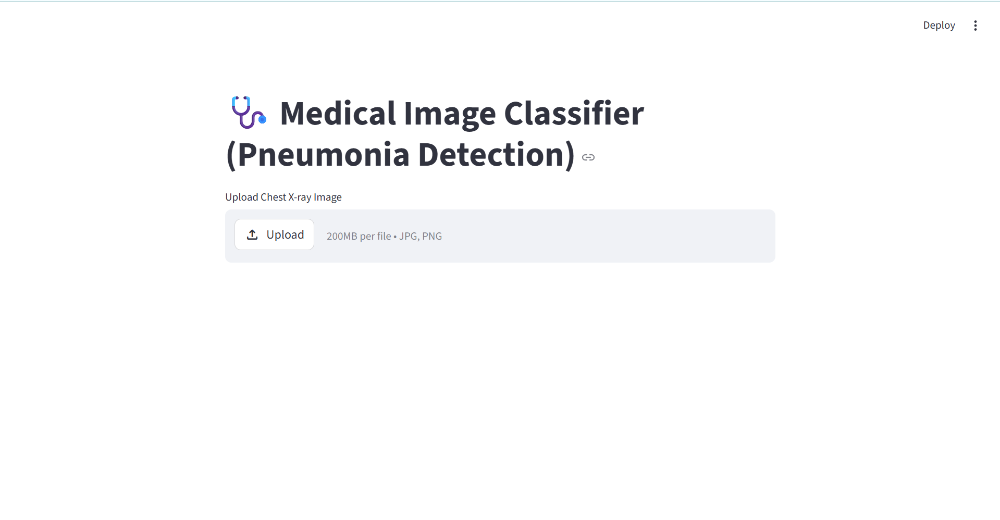
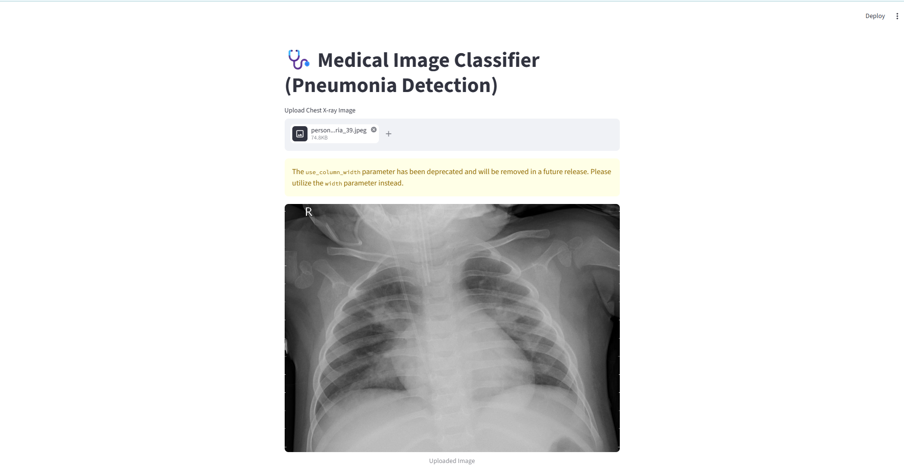
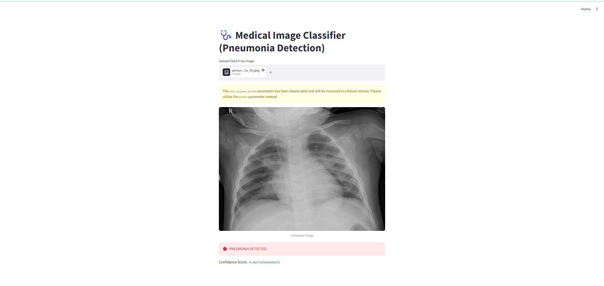

# 🩺 Pneumonia Detection using Deep Learning

This project is a medical image classifier that detects whether a chest X-ray image shows Pneumonia or Normal lungs using a deep learning model (ResNet50 + TensorFlow) with a Streamlit web app.

---

## 🚀 Features
- Upload chest X-ray images
- Real-time prediction using Streamlit
- Deep Learning model (Transfer Learning - ResNet50)
- High accuracy (~93%)

---

## 🧠 Tech Stack
- Python
- TensorFlow / Keras
- OpenCV
- Streamlit
- NumPy

---

## 📁 Project Structure

```
pneumonia-project/
├── app.py
├── pneumonia_model.h5
├── requirements.txt
├── README.md
```

---

## ▶️ How to Run This Project

1. Install dependencies:
pip install -r requirements.txt

2. Run Streamlit app:
streamlit run app.py

---

## 📊 Model Performance
- Training Accuracy: ~95%
- Validation Accuracy: ~93%

---

## 📸 Screenshots

### 🏠 Home Page


### 📤 Upload X-ray Image


### 🧠 Prediction Result



## ⚠️ Disclaimer
This project is for educational purposes only and should NOT be used for real medical diagnosis.

---

## 👨‍💻 Author
ARYAN HARSH
=======
